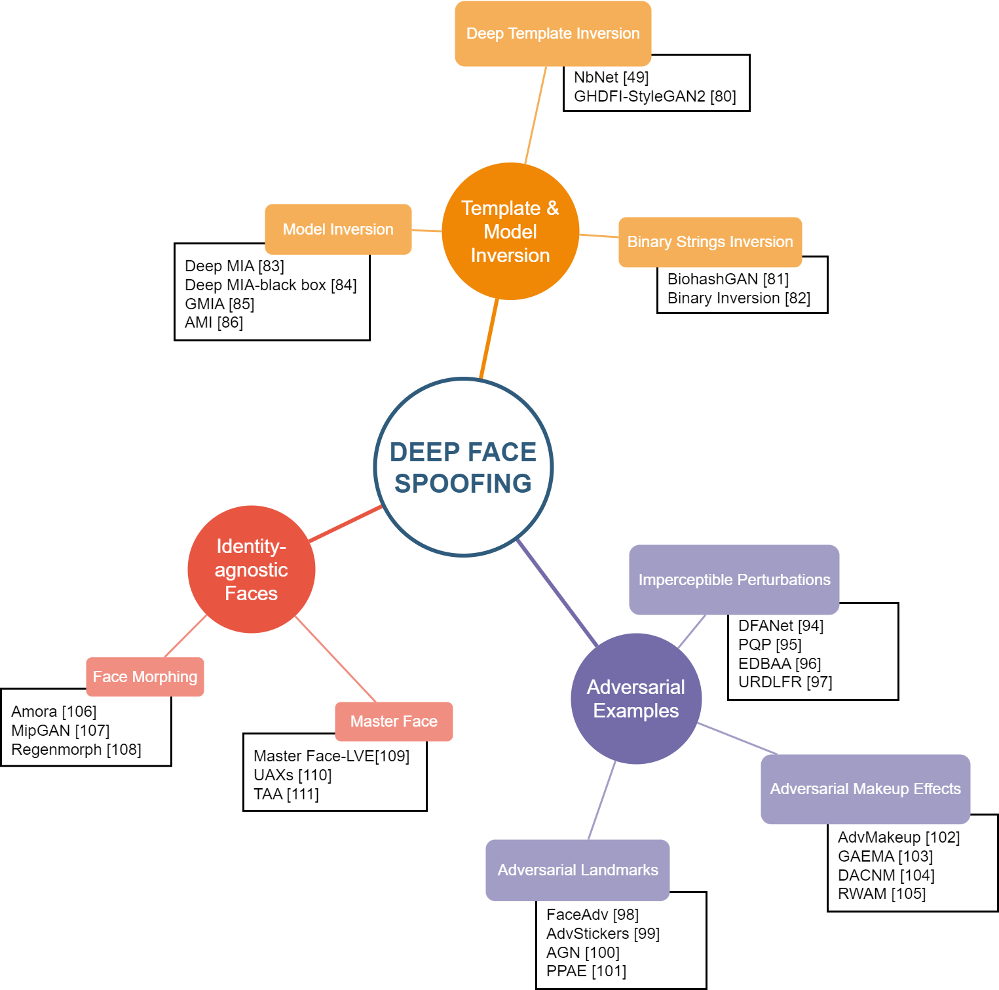
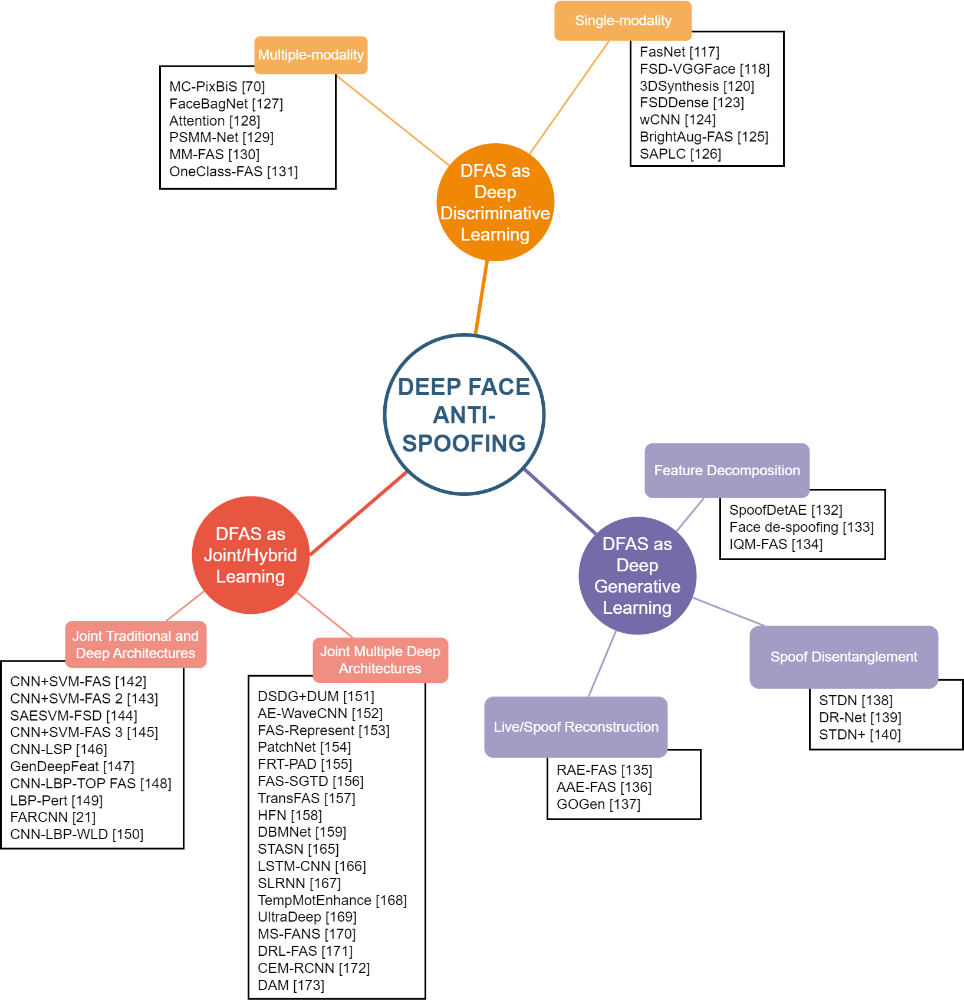

# 👏Review of Deep Face Spoofing and Anti-Spoofing🎭 #

   
<p\>

This is the accompanying webpage for "Deep Facial Spoofing and Deep Face Anti-Spoofing: a Systematic Literature Review", a critical review of recent progress in deep learning methods for face spoofing and anti-spoofing.

## Introduction
We present taxonomies and provide an up-to-date and critical review of recent deep-face spoofing (DFS) and deep face anti-spoofing (DFAS) models. We identify three main groups of DFS mechanisms: template and model inversion, adversarial examples, and identity-agnostic faces. Likewise, DFAS mechanisms could be divided into three categories: DFAS as deep discriminative learning, DFAS as generative learning, and DFAS as joint or hybrid learning.

🔔This webpage will be continuously updated with new studies🔥
_____________

## Contents ##
* [Deep Face Spoofing](#DFS)
    * [DFS1: Template and Model Inversion](#DFS1)
    * [DFS2: Adversarial Examples](#DFS2)
    * [DFS3: Identity-Agnostic Faces](#DFS3)
* [Deep Face-Anti Spoofing](#DFAS)
    * [DFAS1: DFAS as Deep Discriminative Learning](#DFAS1)
    * [DFAS2: DFAS as Deep Generative Learning](#DFAS2)
    * [DFAS3: DFAS as Joint/Hybrid Learning](#DFAS3)
        * [Joint Traditional and Deep Architectures](#Joint1)
        * [Joint Multiple Deep Architectures](#Joint2)
        
_____________

### 1️⃣Deep Face Spoofing ####

   
<p\>

#### DFS1: Template and Model Inversion ####

    
   <b>Deep Template Inversion</b>  
    
   <b>Deep Model Inversion</b>  
<p\>

 Method            | Year | Category                    | Backbone                                   | White/Grey/Black Box   | Static/Dynamic |
| ----------------- | ---- | --------------------------- | ------------------------------------------ | ---------------------- | -------------- |
| NbNet             | 2019 | Deep template inversion     | De-CNN                                     | Black                  | S              |
| GHDFI-StyleGAN2   | 2021 | Deep template inversion     | StyleGAN2                                  | Black                  | S              |
| BiohashGAN        | 2022 | Inverting binarizations     | GAN+SimHashNet                             | Black                  | S              |
| Binary Inversion  | 2021 | Inverting binarizations     | De-CNN+FCN                                 | White                  | S              |
| Deep MIA          | 2022 | Model inversion             | α\-GAN+Face Seed Initialization            | White                  | S              |
| Deep MIA-blackbox | 2021 | Model inversion             | VAE                                        | Black                  | S              |
| GMIA              | 2020 | Model inversion             | GAN                                        | White                  | S              |
| AMI               | 2019 | Model inversion             | Transposed CNN                             | Black                  | S              |
    

#### DFS2: Adversarial Examples

    
   <b>Imperceptible Perturbations</b>  
    
   <b>Adversarial Landmarks</b>  
    
   <b>Adversarial Makeup Effects</b>  
 

    
| Method            | Year | Category                    | Backbone                                   | White/Grey/Black Box   | Static/Dynamic |
| ----------------- | ---- | --------------------------- | ------------------------------------------ | ---------------------- | -------------- |
| DFANet            | 2021 | Imperceptible perturbations | Deep Face Model+Dropout                    | Black                  | S              |
| PQP               | 2021 | Imperceptible perturbations | Deep Face Model+SSIM Gradient              | Black                  | S              |
| EDBAA             | 2019 | Imperceptible perturbations | Deep Face Model+(1+1)-CMA-ES               | Black                  | S              |
| FaceAdv           | 2021 | Adversarial landmarks       | GAN+RSO                                    | White and Black        | S              |
| AGN               | 2019 | Adversarial landmarks       | Deep Convolutional GAN                     | White                  | S              |
| PPAE              | 2022 | Adversarial landmarks       | Smoothness Loss                            | White and Black        | S              |
| AdvStickers       | 2022 | Adversarial landmarks       | Deep Face Model+RHDE                       | Black                  | S              |
| GAEMA             | 2019 | Adversarial makeup effects  | GANs                                       | White                  | S              |
| Adv-makeup        | 2021 | Adversarial makeup effects  | GANs                                       | Black                  | S              |
| RWAM              | 2022 | Adversarial makeup effects  | Cycle-GAN                                  | White                  | D              |
| DACNM             | 2021 | Adversarial makeup effects  | Facenet                                    | Black                  | D              |

#### DFS3: Identity-Agnostic Faces

    
   <b>Deep Template Inversion</b>  
    
   <b>Master Face</b>  
 <p\>
    
| Method            | Year | Category                    | Backbone                                   | White/Grey/Black Box   | Static/Dynamic |
| ----------------- | ---- | --------------------------- | ------------------------------------------ | ---------------------- | -------------- |
| Amora             | 2020 | Morphing face               | GAN                                        | Black                  | S              |
| Mipgan            | 2021 | Morphing face               | GANs                                       | Unknown                | S              |
| Regenmorph        | 2021 | Morphing face               | GAN                                        | Unknown                | S              |
| Master Face-LVE   | 2022 | Master face                 | StyleGAN+LVE                               | White, Grey, and Black | S              |
| UAXs              | 2021 | Master face                 | Deep Face Model+mini-batch L2 optimization | White and Black        | S              |
| TAA               | 2020 | Master face                 | Deep Face Model+brute force attack         | Black                  | S              |

_____________

### 2️⃣Deep Face-Anti Spoofing ####

   
<p\ >

#### DFAS1: DFAS asDeep Discriminative Learning

    
   <b>DFAS with Single Modality</b>  
    
   <b>DFAS with Multiple Modalities</b>  
 <p\>

| Method                      | Year | Input                         | Category                                | Backbone                                                 | Loss Function                                                             | Image/Video |
| --------------------------- | ---- | ----------------------------- | --------------------------------------- | -------------------------------------------------------- | ------------------------------------------------------------------------- | ----------- |
| 3DSynthesis                 | 2019 | RGB                           | Single-Modal                            | ResNet-15                                                | Binary cross entropy                                                      | I           |
| FASNet                      | 2017 | RGB                           | Single-Modal                            | VGG-16                                                   | Binary cross entropy                                                      | V           |
| FSD-VGGFace                 | 2021 | RGB                           | Single-Modal                            | VGG-Face                                                 | Binary cross entropy                                                      | V           |
| FSDDense                    | 2020 | RGB                           | Single-Modal                            | DenseNet-121                                             | Binary cross entropy                                                      | V           |
| MC-PixBiS                   | 2020 | SWIR images differences       | Multi-modal                             | DenseNet-161                                             | Binary cross entropy                                                      | V           |
| FaceBagNet                  | 2019 | RGB, Depth, NIR face patches  | Multi-modal                             | Multi-stream CNN                                         | Binary cross entropy                                                      | V           |
| Attention                   | 2019 | RGB, Depth, NIR               | Multi-modal                             | ResNet-18                                                | Binary cross entropy                                                      | V           |
| PSMM-Net                    | 2019 | RGB, Depth and infrared (IR)  | Multi-modal                             | ResNet-18                                                | Binary cross entropy                                                      | V           |
| MM-FAS                      | 2019 | RGB, Depth and infrared (IR)  | Multi-modal                             | ResNet-18/50                                             | Binary cross entropy                                                      | V           |
| OneClass-FAS                | 2021 | Grayscale, IR, Depth, Thermal | Multi-modal           | MCCNN                                                    | Binary cross entropy and contrastive loss                                 | V           |

#### DFAS2: DFAS as Deep Generative Learning

    
   <b>Auto-Encoder-based DFAS</b>  
    
   <b>GAN-based DFAS</b>  
 <p\>

| Method                      | Year | Input                         | Category                                | Backbone                                                 | Loss Function                                                             | Image/Video |
| --------------------------- | ---- | ----------------------------- | --------------------------------------- | -------------------------------------------------------- | ------------------------------------------------------------------------- | ----------- |
| SpoofDetAE                  | 2022 | RGB                           | Feature decomposition and reduction     | Convolutional Autoencoders+ Softmax                      | Reconstruction Loss                                                       | V           |
| Face de-spoofing            | 2018 | RGB+HSV                       | Spoof decomposition                     | Autoencoders                                             | Magnitude Loss+Zero/One Map Los+Repetitive Loss                           | V           |
| IQM-FAS                     | 2016 | RGB+OFM                       | Feature decomposition and integration   | Autoencoders+Softmax                                     | Binary cross entropy                                                      | V           |
| RAE-FAS                     | 2019 | RGB                           | Live/spoof faces reconstruction         | U-Net based Autoencoders                                 | SSIM+L1 Loss                                                              | V           |
| AAE-FAS                     | 2021 | RGB                           | Live faces reconstruction               | Autoencoders                                             | reconstruction error + attention loss                                     | V           |
| GOGen                       | 2020 | RGB+one hot vector            | Spoof reconstruction and identification | GAN                                                      | L2 Loss                                                                   | V           |
| STDN                        | 2020 | RGB                           | Spoof disentanglement                   | U-Net+PatchGAN                                           | ESR, Adversarial, L2, and Pixel Losses                                    | V           |
| DR-Net                      | 2022 | RGB                           | Spoof augmentation and disentanglement  | Encoder-Decoder                                          | Identity Loss                                                             | V           |
| STDN+                       | 2022 | RGB                           | Two-steps spoof disentanglement         | GAN+Encoder Deecoder                                     | L2, inpainting mask, adversarial, depth-map, and synthesized spoof losses | V           |

#### DFAS3: DFAS as Joint/Hybrid Learning

##### Joint Traditional and Deep Architectures

| Method                      | Year | Input                         | Category                                | Backbone                                                 | Loss Function                                                             | Image/Video |
| --------------------------- | ---- | ----------------------------- | --------------------------------------- | -------------------------------------------------------- | ------------------------------------------------------------------------- | ----------- |
| CNN+SVM-FAS                 | 2019 | RGB                           | Hybrid learning                         | VGG-16+SVM                                               | SVM Loss                                                                  | V           |
| CNN+SVM-FAS 2               | 2017 | RGB                           | Hybrid learning                         | VGG-Face+SVM                                             | SVM Loss                                                                  | V           |
| SAESVM-FSD                  | 2016 | RGB                           | Hybrid learning                         | SAE+SVM                                                  | SVM Loss                                                                  | V           |
| CNN+SVM-FAS 3               | 2019 | RGB                           | Hybrid learning                         | ResNet-50+SVM                                            | SVM Loss                                                                  | V           |
| CNN-LSP                     | 2019 | RGB                           | Hybrid learning                         | 1D CNN + SVM                                             | SVM Loss                                                                  | V           |
| Generalizaed Deep Features  | 2018 | RGB                           | Multi-scale information                 | 3D CNN                                                   | Binary cross entropy + generalization loss                                | V           |
| CNN-LBP-TOP FAS             | 2017 | RGB                           | Hybrid learning                         | 5 Layer CNN + LBP-TOP                                    | Binary cross entropy + SVM Loss                                           | V           |
| LBP-Pert                    | 2020 | RGB                           | Hybrid learning                         | CNN+LBP                                                  | Binary cross entropy                                                      | V           |
| CNN-LBP-WLD                 | 2019 | RGB                           | Hybrid learning                         | CaffeNet                                                 | Binary cross entropy                                                      | V           |

##### Joint Multiple Deep Architectures

| Method                      | Year | Input                         | Category                                | Backbone                                                 | Loss Function                                                             | Image/Video |
| --------------------------- | ---- | ----------------------------- | --------------------------------------- | -------------------------------------------------------- | ------------------------------------------------------------------------- | ----------- |
| DSDG+DUM                    | 2021 | RGB                           | Hybrid learning                         | CDCN                                                     | Binary cross entropy + L2 Loss                                            | V           |
| AE-WaveCNN                  | 2019 | RGB                           | Hybrid learning                         | CNN + Autoencoders                                       | Binary cross entropy                                                      | V           |
| FAS-Represent               | 2020 | RGB                           | Hybrid learning                         | CNN + GAN                                                | Latent Reconstruction, depth, LBP, discriminator, and generator Losses    | V           |
| PatchNet                    | 2022 | RGB                           | Hybrid learning                         | Double Encoders                                          | Asymmetric AM-Softmax Loss, Self-Supervised Similarity Loss               | V           |
| FRT-PAD                     | 2021 | RGB                           | Hybrid learning                         | CNN+GNN                                                  | Binary cross entropy                                                      | V           |
| AuxSup                      | 2018 | RGB and HSV                   | Hybrid learning                         | CNN + RNN                                                | depth and rPPG loss                                                       | V           |
| FAS-SGTD                    | 2020 | RGB                           | Hybrid learning                         | RSGB + STPM                                              | Contrastive Detph Loss                                                    | V           |
| TransFAS                    | 2022 | RGB                           | Hybrid learning                         | Encoders with Cross-Layer Attentions                     | L2 + Contrastive Detph Loss                                               | V           |
| Hierarchical Fusion Network (HFN) | 2022 | RGB                           | Hybrid learning                         | Residual Module + HFM                                    | Binary cross entropy + L2 Loss                                            | V           |
| DBMNet                      | 2022 | RGB and Depth                 | Hybrid learning                         | feature embedding (FE) and depth estimating (DE) modules | binary cross-entropy and distribution alignment losses                    | V           |
| STASN                       | 2019 | RGB                           | Multi-scale information                 | ResNet50+LSTM                                            | Binary cross entropy                                                      | V           |
| lstm-cnn                    | 2015 | RGB                           | Multi-scale information                 | CNN+LSTM                                                 | Binary cross entropy                                                      | V           |
| SLRNN                       | 2019 | RGB                           | Multi-scale information                 | ResNet50+LSTM                                            | Binary cross entropy                                                      | V           |
| Temp-Motion Enhancement     | 2020 | RGB                           | Multi-scale information                 | VGG-face+LSTM                                            | Binary cross entropy                                                      | V           |
| UltraDeep                   | 2017 | RGB                           | Multi-scale information                 | ResNet50+LSTM                                            | Binary cross entropy                                                      | V           |
| MS-FANS                     | 2018 | RGB                           | Multi-scale information                 | AlexNet+LSTM                                             | Binary cross entropy                                                      | V           |
| DRL-FAS                     | 2021 | RGB                           | Multi-scale information                 | ResNet-18+GRU                                            | Binary cross entropy                                                      | I           |
| CEM-RCNN                    | 2021 | RGB                           | anomaly detection                       | RPN+RCNN                                                 | Binary cross entropy + L1 loss                                            | V           |
| DAM                         | 2021 | RGB                           | Multi-scale information                 | VGG16, TSM                                               | Symmetry Loss                                                             | V           |
